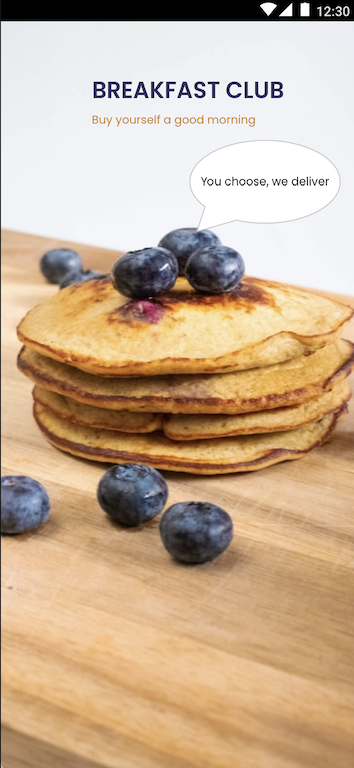

# BreakfastClub-React-Native

School project. App made with React-Native. The app is Breakfast Club app, where user can buy breakfast.
UI layout made with Sketch.

## Icons made with Sketch:

## Expo SDK
- ViewPager
- Font
- Localization
- LinearGradient

## AWS-database

## How to run
- clone project
- npm install -g expo-cli
- npm install
- expo start

