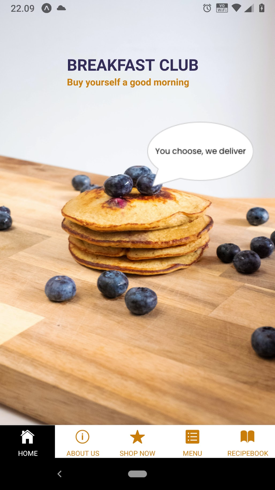

# BreakfastClub-React-Native

School project. App made with React-Native. The app is Breakfast Club app, where user can buy breakfast.
UI layout made with Sketch.


 


## Icons made with Sketch:


## React Native Elements
- Avatar
- Tile

## Navigation
- React-navigation/bottom-tabs

## Expo SDK
- ViewPager
- Font
- LinearGradien
- Splash Screen

## AWS-database

## How to run
- clone project
- npm install -g expo-cli
- npm install
- expo start

### Example how to put data to dynamodb table:
````shell script
aws dynamodb put-item \
      --table-name menu-dev \
      --item file://menu1.json
````

### Example how to get data from dynamodb table:

#### 1.
      
````shell script
aws dynamodb get-item \
   --table-name menu-dev \
   --key '{ "title": {"S": "Desserts"}}'
````
 
 #### 2.
   
```shell script
aws dynamodb query \
 --table-name menu-dev \
 --key-condition-expression "title = :name" \
 --expression-attribute-values '{":name":{"S":"Desserts"}}'
```         